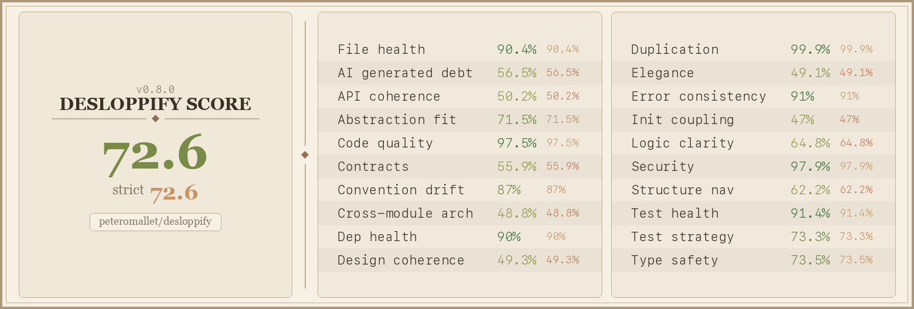

# Desloppify - an agent harness to make your codebase 🤌

[](https://pypi.org/project/desloppify/) 

Desloppify gives your AI coding agent the tools to identify, understand, and systematically improve codebase quality. It combines mechanical detection (dead code, duplication, complexity) with subjective LLM review (naming, abstractions, module boundaries), then works through a prioritized fix loop. State persists across scans so it chips away over multiple sessions, and the scoring is designed to resist gaming.


The score gives your agent a north-star, and the tooling helps it plan, execute, and resolve issues until it hits your target — with a lot of tricks to keep it on track. A score above 98 should correlate with a codebase a seasoned engineer would call beautiful.

That score generates a scorecard badge for your GitHub profile or README:



Currently supports 28 languages — full plugin depth for TypeScript, Python, C#, Dart, GDScript, and Go; generic linter + tree-sitter support for Rust, Ruby, Java, Kotlin, and 17 more.

## For your agent's consideration...

Paste this prompt into your agent:

```
I want you to improve the quality of this codebase. To do this, install and run desloppify.
Run ALL of the following (requires Python 3.11+):

pip install --upgrade "desloppify[full]"
desloppify update-skill claude    # installs the full workflow guide — pick yours: claude, cursor, codex, copilot, windsurf, gemini

Before scanning, check for directories that should be excluded (vendor, build output,
generated code, worktrees, etc.) and exclude obvious ones with `desloppify exclude <path>`.
Share any questionable candidates with me before excluding.

desloppify scan --path .
desloppify next

--path is the directory to scan (use "." for the whole project, or "src/" etc).

Your goal is to get the strict score as high as possible. The scoring resists gaming — the
only way to improve it is to actually make the code better.

THE LOOP: run `next`. It tells you what to fix, which file, and the resolve command to run
when done. Fix it, resolve it, run `next` again. Over and over. This is your main job.

Don't be lazy. Large refactors and small detailed fixes — do both with equal energy. No task
is too big or too small. Fix things properly, not minimally.

Use `plan` to reorder priorities or cluster related issues. Rescan periodically. The scan
output includes agent instructions — follow them, don't substitute your own analysis.
```

## From Vibe Coding to Vibe Engineering

Vibe coding gets things built fast. But the codebases it produces tend to rot in ways that are hard to see and harder to fix — not just the mechanical stuff like dead imports, but the structural kind. Abstractions that made sense at first stop making sense. Naming drifts. Error handling is done three different ways. The codebase works, but working in it gets worse over time.

LLMs are actually good at spotting this now, if you ask them the right questions. That's the core bet here — that an agent with the right framework can hold a codebase to a real standard, the kind that used to require a senior engineer paying close attention over months.

So we're trying to define what "good" looks like as a score that's actually worth optimizing. Not a lint score you game to 100 by suppressing warnings. Something where improving the number means the codebase genuinely got better. That's hard, and we're not done, but the anti-gaming stuff matters to us a lot — it's the difference between a useful signal and a vanity metric.

The hope is that anyone can use this to build something a seasoned engineer would look at and respect. That's the bar we're aiming for.

If you'd like to join a community of vibe engineers who want to build beautiful things, [come hang out](https://discord.gg/aZdzbZrHaY).


---

Issues, improvements, and PRs are hugely appreciated — [github.com/peteromallet/desloppify](https://github.com/peteromallet/desloppify).

MIT License
